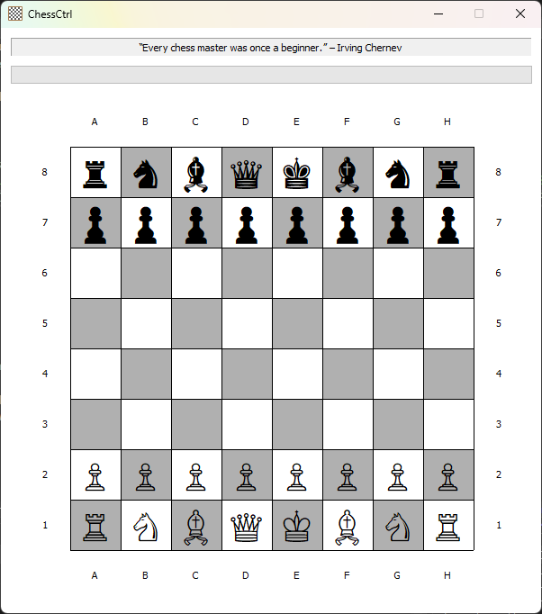

**ChessCtrl** is a fully featured Chess Control written in C++ with the help of the MFC library. The main class is, you guessed, `CChessCtrl`, which includes `ChessBoard` class.

`ChessBoard` class implements the following functions:

- `void resetBoard()`: makes a new game; rest the fields of the engine and insert appropriate pieces onto the board.
- `void submitMove(const TCHAR* fromSquare, const TCHAR* toSquare)`
- `void getANewBoard()`
- `void makeGameInCheck()`
- `void makeGameNotInCheck()`
- `void beginAGame()`
- `void endTheGame()`
- `void makeWhiteGoesNext()`
- `bool gameCanContinue(wstring sourceFileRank, wstring destFileRank)`: checks if the game is not ended.
- `bool sourceAndDestIsValid(wstring sourceFileRank, wstring destFileRank)`: check if given source and dest's file and rank represenation is valid (wstring with 2 chars) and are within chess board.
- `bool withinChessBoard(wstring fileRank)`: checks if file is in range 'A'-'H', rank is in range '1'-'8'.
- `bool sourceIsNotEmpty(wstring sourceFileRank, Board* board)`: checks if source is not an empty square (i.e. there is a piece to move).
- `bool isCurrentPlayerPiece(bool isWhiteTurn, Piece* piece, wstring sourceFileRank)`: checks if the piece at source belongs to the player in turn.
- `bool pieceMoveIsValid(int returnCode, Piece* piece, wstring sourceFileRank, wstring destFileRank)`: checks if the return code for validating piece move is zero.
- `bool pieceMoveKeepsKingSafe(bool isWhiteTurn, Piece* piece, wstring sourceFileRank, wstring destFileRank, Board* sandboxBoard)`: checks if given side's King is safe under the given board (in ChessBoard it would be a sandbox), if not give out an error to user and return false.
- `void handleInvalidMove(int returnCode, Piece* piece, wstring sourceFileRank, wstring destFileRank)`: calls the error handler to print the error, passing the information given by the calling functions.
- `bool kingIsSafeFromRivalry(bool isWhiteTurn, Board* board)`: returns true if none of the Pieces of the other side can capture the given side's King (i.e. has a valid move to the King's file and rank).
- `bool playerHaveValidMove(bool isWhiteTurn, Board* board)`: returns true if the given side have a valid move on the given board.
- `wstring findPlayersKingFileRank(bool isWhiteTurn, Board* board)`: iterates and returns the location (file & rank) of the given side's King.
- `Piece* tryMoveAndReturnCaptured(wstring sourceFileRank, wstring destFileRank, Board* board)`: Given a board, conducts move from source to destination & get the captured; Case 1 (try block) - Another piece in destination (conduct capture); Case 2 (catch block) - No piece exists in destination (conduct move). Return the piece if in case 1, NULL otherwise.
- `void confirmMoveOnBoard(wstring sourceFileRank, wstring destFileRank, Board* board)`: Given a board, conduct the move from source to destination; Case 1 (try block) - Another piece in destination (conduct capture); Case 2 (catch block) - No piece exists in destination (conduct move).
- `void switchPlayers()`
- `Board* cloneBoard(Board* board)`: deep clone the given board - including all the Piece within the map.
- `void deepCleanBoard(Board* board)`: deep clean the given board, free all containing Piece's memory and itself.
- `bool showMoveAndCheckIfGameCanContinue(Piece* piece, wstring sourceFileRank, Piece* capturedPiece, wstring destFileRank, bool isWhiteTurn, Board* board)`: Printing methods, in both text and graphics, on stdout.
- `void ComputerPlayer()`: implements the Backtracking algorithm for computer's Black pieces move, if enabled.

`ChessBoard` class includes the following classes:

- `EmptyPiece` (derived from `Piece`)
- `Bishop` (derived from `Piece`)
- `King` (derived from `Piece`)
- `Knight` (derived from `Piece`)
- `Pawn` (derived from `Piece`)
- `Queen` (derived from `Piece`)
- `Rook` (derived from `Piece`)

`Piece` class declares the follwing virtual functions:

- `Piece* clone()`: returns a different object with same information of itself.
- `int isValidMove(wstring sourceFileRank, wstring destFileRank, map<wstring, Piece*>* board)`
- `wstring playerToString()`: return wstring rep. of the piece's player.
- `wstring toString()`: returns the wstring rep. of the piece.
- `wstring toGraphics()`: returns graphical rep. of the piece.
- `int Score()`: return the score of the piece (used by Backtracking algorithm to perform the computer move).

And it implements the following functions:

- `void confirmMove()`: sets `isFirstMove` false when called as it has moved at least once.
- `bool isWhitePlayer()`: returns if this piece belongs to White player.
- `bool isKing()`: returns true if the piece is a King (represented by _isKing_ - only set to true by King constructor).
- `bool isFriendly(Piece* that)`: returns true if this and that Piece belongs to same player.
- `bool isSameFile(wstring sourceFileRank, wstring destFileRank)`: returns true if sourceFileRank and destFileRank is on the same file / rank / diagonal respectively; otherwise, false.
- `bool isSameRank(wstring sourceFileRank, wstring destFileRank)`: returns true if sourceFileRank and destFileRank is on the same file / rank / diagonal respectively; otherwise, false.
- `bool isSameDiagonal(wstring sourceFileRank, wstring destFileRank)`: returns true if sourceFileRank and destFileRank is on the same file / rank / diagonal respectively; otherwise, false.
- `bool noVerticalObstruction(wstring sourceFileRank, wstring destFileRank, map<wstring, Piece*>* board)`: returns true if there are no pieces on intermediate ranks on the board; otherwise, false.
- `bool noHorizontalObstruction(wstring sourceFileRank, wstring destFileRank, map<wstring, Piece*>* board)`: returns true iff there are no pieces on intermediate files on the board; otherwise, false.
- `bool noDiagonalObstruction(wstring sourceFileRank, wstring destFileRank, map<wstring, Piece*>* board)`: return true if there are no pieces on intermediate files and ranks, which is on the same diagonal, on the board; otherwise, false.
- `bool destExistFriendlyPiece(wstring destFileRank, map<wstring, Piece*>* board)`: return true if there are no pieces on intermediate files and ranks, which is on the same diagonal, on the board; otherwise, false.

# Rules of chess

The **rules of chess** (also known as the **laws of chess**) govern the play of the game of [chess](https://en.wikipedia.org/wiki/Chess "Chess"). Chess is a two-player abstract strategy board game. Each player controls sixteen pieces of six types on a chessboard. Each type of piece moves in a distinct way. The object of the game is to checkmate the opponent's king; checkmate occurs when a king is threatened with capture and has no escape. A game can end in various ways besides checkmate: a player can resign, and there are several ways a game can end in a draw.

While the exact origins of chess are unclear, modern rules first took form during the Middle Ages. The rules continued to be slightly modified until the early 19th century, when they reached essentially their current form. The rules also varied somewhat from region to region. Today, the standard rules are set by FIDE (Fédération Internationale des Échecs), the international governing body for chess. Slight modifications are made by some national organizations for their own purposes. There are variations of the rules for fast chess, correspondence chess, online chess, and Chess960.

Besides the basic moves of the pieces, rules also govern the equipment used, time control, conduct and ethics of players, accommodations for physically challenged players, and recording of moves using chess notation. Procedures for resolving irregularities that can occur during a game are provided as well.

## Initial setup

Chess is played on a chessboard, a square board divided into a grid of 64 squares (eight-by-eight) of alternating color (similar to the board used in draughts). Regardless of the actual colors of the board, the lighter-colored squares are called "light" or "white", and the darker-colored squares are called "dark" or "black". Sixteen "white" and sixteen "black" pieces are placed on the board at the beginning of the game. The board is placed so that a white square is in each player's near-right corner. Horizontal rows are called _ranks_, and vertical columns are called _files_.

Each player controls sixteen pieces:
- King
- Queen
- Rook
- Bishop
- Knight
- Pawn

At the beginning of the game, the pieces are arranged as shown in the diagram: for each side one king, one queen, two rooks, two bishops, two knights, and eight pawns. The pieces are placed, one per square, as follows:

- Rooks are placed on the outside corners, right and left edge.
- Knights are placed immediately inside of the rooks.
- Bishops are placed immediately inside of the knights.
- The queen is placed on the central square of the same color of that of the piece: white queen on the white square and black queen on the black square.
- The king takes the vacant spot next to the queen.
- Pawns are placed one square in front of all of the other pieces.

Popular mnemonics used to remember the setup are "queen on her own color" and "white on right". The latter refers to setting up the board so that the square closest to each player's right is white.

## Gameplay

The player controlling the white pieces is named "White"; the player controlling the black pieces is named "Black". White moves first, then players alternate moves. Making a move is required; it is not legal to skip a move, even when having to move is detrimental. Play continues until a king is checkmated, a player resigns, or a draw is declared, as explained below. In addition, if the game is being played under a time control, a player who exceeds the time limit loses the game unless they cannot be checkmated.

The official chess rules do not include a procedure for determining who plays White. Instead, this decision is left open to tournament-specific rules (e.g. a Swiss system tournament or round-robin tournament) or, in the case of casual play, mutual agreement, in which case some kind of random choice such as flipping a coin can be employed. A common method is for one player to conceal a pawn of each color in either hand; the other player chooses a hand to open and receives the color of the piece that is revealed.

### Movement

#### Basic moves

Each type of chess piece has its own method of movement. A piece moves to a vacant square except when capturing an opponent's piece.

Except for any move of the knight and castling, pieces cannot jump over other pieces. A piece is _captured_ (or _taken_) when an attacking enemy piece replaces it on its square. The captured piece is thereby permanently removed from the game. The king can be put in check but cannot be captured (see below).

- The king moves exactly one square horizontally, vertically, or diagonally. A special move with the king known as _castling_ is allowed only once per player, per game (see below).
- A rook moves any number of vacant squares horizontally or vertically. It also is moved when castling.
- A bishop moves any number of vacant squares diagonally. (Thus a bishop can move to only light or dark squares, not both.)
- The queen moves any number of vacant squares horizontally, vertically, or diagonally.
- A knight moves to one of the nearest squares not on the same rank, file, or diagonal. (This can be thought of as moving two squares horizontally then one square vertically, or moving one square horizontally then two squares vertically—i.e. in an "L" pattern.) The knight is not blocked by other pieces; it jumps to the new location.
- Pawns have the most complex rules of movement:

- A pawn moves straight forward one square, if that square is vacant. If it has not yet moved, a pawn also has the option of moving _two_ squares straight forward, provided both squares are vacant. Pawns cannot move backwards.
- A pawn, unlike other pieces, captures differently from how it moves. A pawn can capture an enemy piece on either of the two squares diagonally in front of the pawn. It cannot move to those squares when vacant except when capturing _en passant_.

The pawn is also involved in the two special moves _en passant_ and promotion.

#### Castling

Castling consists of moving the king two squares towards a rook, then placing the rook on the other side of the king, adjacent to it. Castling is only permissible if all of the following conditions hold:

- The king and rook involved in castling must not have previously moved;
- There must be no pieces between the king and the rook;
- The king may not currently be under attack, nor may the king pass through or end up in a square that is under attack by an enemy piece (though the rook is permitted to be under attack and to pass over an attacked square);
- The castling must be kingside or queenside as shown in the diagram.

An unmoved king and an unmoved rook of the same color on the same rank are said to have _castling rights_.

#### _En passant_

When a pawn advances two squares on its initial move and ends the turn adjacent to an enemy pawn on the same rank, it may be captured _en passant_ by the enemy pawn as if it had moved only one square. This capture is legal only on the move immediately following the pawn's advance. The diagrams demonstrate an instance of this: if the white pawn moves from a2 to a4, the black pawn on b4 can capture it _en passant_, moving from b4 to a3, and the white pawn on a4 is removed from the board.

#### Promotion

If a player advances a pawn to its eighth rank, the pawn is then _promoted_ (converted) to a queen, rook, bishop, or knight of the same color at the choice of the player (a queen is usually chosen). The choice is not limited to previously captured pieces. Hence it is theoretically possible for a player to have up to nine queens or up to ten rooks, bishops, or knights if all of the player's pawns are promoted.

### Check

A king is _in check_ when it is under attack by at least one enemy piece. A piece unable to move because it would place its own king in check (it is pinned against its own king) may still deliver check to the opposing player.

It is illegal to make a move that places or leaves one's king in check. The possible ways to get out of check are:

- _Move_ the king to a square where it is not in check.
- _Capture_ the checking piece.
- _Interpose_ a piece between the king and the opponent's threatening piece (_block_ the check).

In informal games, it is customary to announce "check" when making a move that puts the opponent's king in check. In formal competitions, however, check is rarely announced.

### End of the game

#### Checkmate

If a player's king is placed in check and there is no legal move that player can make to escape check, then the king is said to be _checkmated_, the game ends, and that player loses.

The diagram shows an example checkmate position. The white king is threatened by the black queen; the empty square to which the king could move is also threatened; and the king cannot capture the queen, because it would then be in check by the rook.

#### Resigning

Either player may _resign_ at any time, conceding the game to the opponent. To indicate resignation, the player may say "I resign". Tipping over the king also indicates resignation, but it should be distinguished from accidentally knocking the king over. Stopping both clocks is not an indication of resigning, since clocks can be stopped to call the arbiter. An offer of a handshake is sometimes used, but it could be mistaken for a draw offer.

Under FIDE Laws, a resignation by one player results in a draw if their opponent has no way to checkmate them via any series of legal moves, or a loss by that player otherwise.

#### Draws

The game ends in a draw if any of these conditions occur:

- The player to move is not in check and has no legal move. This situation is called a stalemate. An example of such a position is shown in the adjacent diagram.
- The game reaches a dead position.
- Both players agree to a draw after one of the players makes such an offer.

In addition, in the FIDE rules, if a player has run out of time (see below), or has resigned, but the position is such that there is no way for the opponent to give checkmate by any series of legal moves, the game is a draw.

FIDE's competitive rules of play allow a player to claim a draw in either of two situations:

- Fifty moves have been made by each player without a capture or promotion of a pawn (this is the fifty-move rule;
- The same position has appeared three times (or has appeared twice and the player claiming the draw can force the third appearance); this is the threefold repetition rule.

These rules help prevent games from being extended indefinitely in tournaments.

There is no longer a rule specifically defining perpetual check as a draw. In such a situation, either the threefold repetition rule or the fifty-move rule will eventually come into effect. More often, the players will simply agree to a draw.

#### Dead position

A _dead position_ is defined as a position where neither player can checkmate their opponent's king by any sequence of legal moves. According to the rules of chess the game is immediately terminated the moment a dead position appears on the board.

Some basic endings are always dead positions; for example:

- king against king;
- king against king and bishop;
- king against king and knight.

Blocked positions can arise in which progress is impossible for either side, such as the diagrammed position; these too are dead positions.

USCF rules, for games played under a time control that does not include delay or increment, allow draw claims for "insufficient losing chances". For example, if each player has only a king and a knight, checkmate is only achievable with the co-operation of both players, even if it is not a dead position.

### Touch-move rule

The touch-move rule is a fundamental principle in chess, ensuring that players commit to moves deliberated mentally, without physically experimenting on the board. According to this rule, a player who touches a piece with the intention of moving it must then move it if legally possible. This rule also applies to capturing: a player who touches an opponent's piece must capture it if a legal capture is available. Special considerations apply for castling and pawn promotion, reflecting their unique nature in the game.

A player who touches a piece to adjust its physical position within a square must first alert the opponent by saying _J'adoube_ or "I adjust". Once the game has started, only the player with the move may touch the pieces on the board.

## Create and Submit your Pull Request

As noted in the [Contributing Rules](https://github.com/mihaimoga/ChessCtrl/blob/main/CONTRIBUTING.md) for _ChessCtrl_, all Pull Requests need to be attached to a issue on GitHub. So the first step is to create an issue which requests that the functionality be improved (if it was already there) or added (if it was not yet there); in your issue, be sure to explain that you have the functionality definition ready, and will be submitting a Pull Request. The second step is to use the GitHub interface to create the Pull Request from your fork into the main repository. The final step is to wait for and respond to feedback from the developers as needed, until such time as your PR is accepted or rejected.

## Acknowledges

This open source project uses the following libraries:

- Bryan Liu's [C++ Chess Simulation](https://github.com/liuchbryan/Chess)
- PJ Naughter's [CHLinkCtrl](https://www.naughter.com/hlinkctrl.html)
- PJ Naughter's [CVersionInfo](https://www.naughter.com/versioninfo.html)
